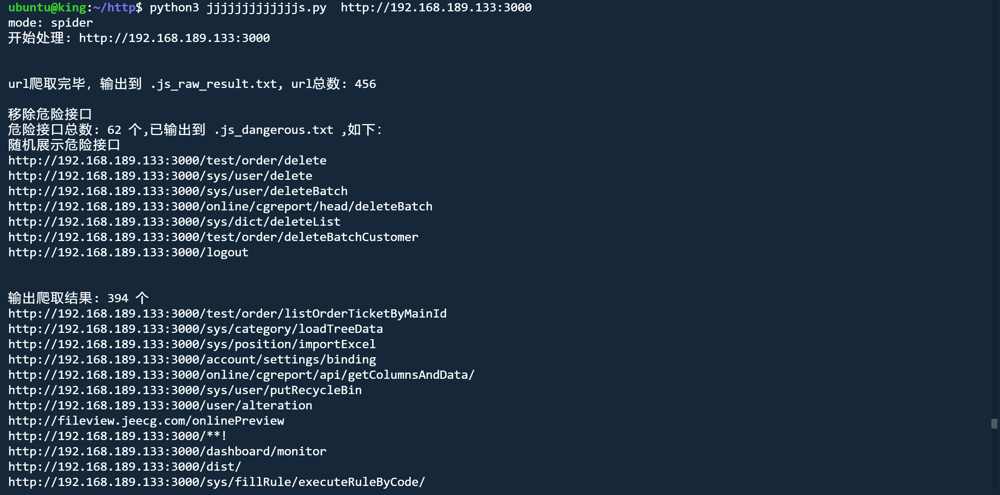
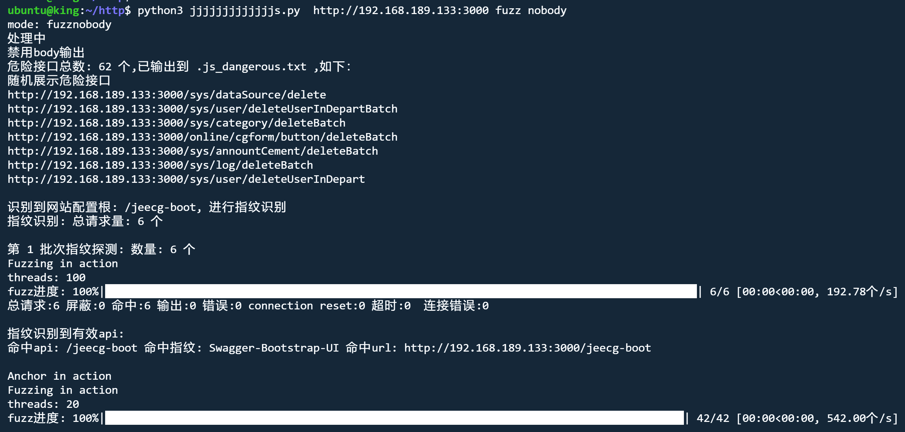
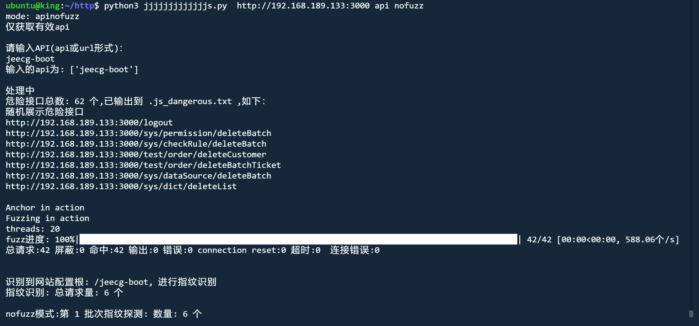

## 简介
针对webpack站点，爬取网站JS文件，分析获取接口列表，自动结合指纹识别和fuzz获取正确api根，可指定api根地址（针对前后端分离项目，可指定后端接口地址），根据有效api根组合爬取到的接口进行自动化请求，发现未授权/敏感信息泄露，回显api响应，定位敏感信息、敏感文件、敏感接口。支持批量模式。

## 流程图


## 使用
环境:

python3.8

安装依赖:

`pip3 install -r requirements.txt`
### 快捷命令

`alias jjjjjjjjjjjjjs='python3 jjjjjjjjjjjjjs.py'`

### 使用方式
```
python3 jjjjjjjs.py  url|urlfile [[fuzz [noapi] [nobody|nofuzz]]|[api [nobody|nofuzz]]]

url|file:目标url或url文件

fuzz:自动fuzz接口

api:用户指定api根路径

noapi:排除输入的指定api

nobody: 禁用输出响应body

nofuzz: 仅获取有效api，无后续响应获取
```
> 注意: 目前参数位置是固定的顺序,不能打乱顺序

### 示例
爬取模式

`python3 jjjjjjjjjjjjjs.py  http://192.168.189.133:3000`



fuzz模式 nobody

`python3 jjjjjjjjjjjjjs.py  http://192.168.189.133:3000 fuzz nobody`




api模式 nofuzz

`python3 jjjjjjjjjjjjjs.py  http://192.168.189.133:3000 api nofuzz`




## 致敬

https://github.com/pingc0y/URLFinder

https://github.com/Str1am/Auto_JsFinder

https://github.com/Threezh1/JSFinder

https://github.com/GerbenJavado/LinkFinder

